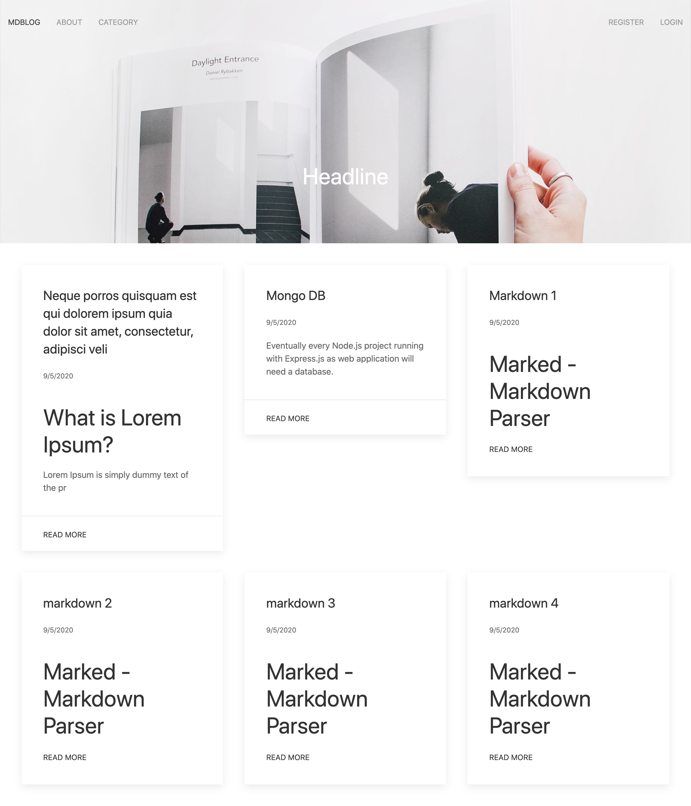

# Simple Markdown Blog

This is simple markdown blog usign ExpressJs.

## How to Use
1. Fork this repository using git clone https://github.com/chimemoo/expressjs-simple-markdown-blog.git
2. Move to project directory, run npm install in terminal
3. To start application, run nodemon server.js

# Screenshoot

## Feature
- Login
- Register
- Create Article
- Category (Soon)
- Discuss (Soon)

## Created Using
- [UI Kit](https://getuikit.com/)
- ExpressJS
- Express Session
- EJS
- Marked
- MongoDB
- Mongoose
- Passport
- Jsdom